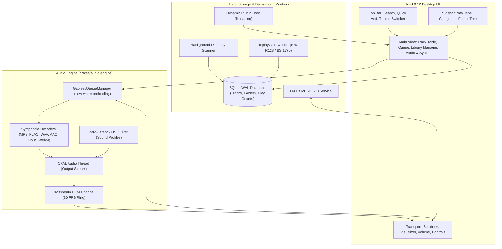

<div align="center">
  
  <h1>Kanono Media Player</h1>
  <p><strong>A modular, ultra-responsive desktop audio player inspired by Foobar2000, built with Rust and Iced.</strong></p>

  [](#license)
  [](https://www.rust-lang.org/)
  [](https://github.com/iced-rs/iced)
  [](https://github.com/pdeljanov/Symphonia)
  [](#installation--getting-started)
</div>

---

<p align="center">
  
</p>

## Overview

**Kanono Media Player** is a lightweight, customizable desktop music player engineered for audiophiles, power users, and collectors. Inspired by the performance, modularity, and catalog control of classic **Foobar2000**, Kanono provides sample-accurate playback, instant library filtering across tens of thousands of tracks, real-time DSP tone sculpting, multiple curated color themes, and hot-swappable latency buffer tuning.

Built entirely in **Rust** using **Iced 0.12**, **CPAL**, and **Symphonia**, Kanono ensures zero audio stutter by completely decoupling audio processing, metadata decoding, background library scanning, and GUI rendering onto dedicated asynchronous worker threads.

---

## Key Features

### 🎨 Dynamic Theme Engine (6 Curated Palettes)
Switch aesthetics instantly without restarting the application:
- **Emerald Dark (Default)**: Deep obsidian workspace (`#090d16`) with vivid emerald green accents (`#10b981`) and slate surfaces.
- **Midnight Cyberpunk**: Deep abyss (`#0b0b14`) with electric magenta (`#d946ef`) and neon cyan highlights.
- **Nordic Frost**: Minimalist polar slate (`#0e1726`) featuring crisp arctic cyan (`#06b6d4`) accents.
- **Amber Sunset**: Warm twilight carbon (`#120e0a`) paired with glowing amber-gold accents (`#f59e0b`).
- **Dracula**: Classic gothic purple darkness (`#1e1f29`) with lavender (`#bd93f9`) and soft pink accents.
- **Solarized Light**: High-contrast, easy-on-the-eyes daylight theme (`#fdf6e3`) with solar teal highlights (`#2aa198`).
- **Quick Cycle Button**: Switch themes directly from the top navigation bar with a single click.
- **Interactive Gallery**: Browse visual cards and descriptions in the **Audio & System** control center.

### 🎛️ Real-Time DSP Sound Coloration Profiles
Shape your sound in-place with zero-latency audio thread filtering:
- **Flat (Studio Reference)**: Bit-perfect, uncolored pass-through.
- **Bass Boost (+4.5 dB)**: Low-end warmth and punch for subwoofers and bass-heavy tracks (< 150 Hz).
- **Warm Vintage (Analog Tape)**: Softens harsh high frequencies (> 8.5 kHz) with warm, relaxed lower-mids.
- **Vocal Clarity (+3.0 dB)**: Enhances vocal separation and lyrical presence (1 kHz – 3.5 kHz).
- **Treble Air (+3.5 dB)**: Open, airy top-end sparkle for acoustic, classical, and orchestral recordings (> 10 kHz).
- **Club Punch**: Dynamic club coloration combining deep bass reinforcement with boosted presence.

### 🔊 Target Loudness Reference & ReplayGain
- **EBU R128 & ITU-R BS.1770 Standards**: Integrated loudness and true-peak analysis computed on a dedicated background worker.
- **Configurable Loudness Targets**:
  - **-14 LUFS (Streaming Standard)**: Calibrated for Spotify, YouTube, and modern commercial masters.
  - **-18 LUFS (Balanced Default)**: Dynamic audiophile master standard preserving transient response.
  - **-23 LUFS (Broadcast Standard)**: Strict EBU R128 European television and radio broadcast compliance.
- **Auto Gain Offsetting**: Smooth dynamic gain shifting when ReplayGain mode is toggled on.

### ⚡ Audio Hardware Output & Latency Tuning
- **Hardware Introspection**: Inspect your sound card, active host API (ALSA, PipeWire, PulseAudio), true sample rate, channel count, sample format, and driver buffer bounds.
- **Hot-Swappable Latency Profiles**: Change audio buffer sizes on the fly without interrupting playback or losing position:
  - **Adaptive (System Default)**: Lets PipeWire / ALSA automatically manage buffer sizing.
  - **Low Latency (512 frames / ~11 ms)**: Snappy response for rapid seeking and live playback controls.
  - **Balanced (1024 frames / ~23 ms)**: Optimal balance between low latency and CPU efficiency.
  - **Safe Buffer (2048 frames / ~46 ms)**: Maximum protection against buffer underruns under heavy CPU loads.
- **Diagnostics & Calibration Tools**:
  - **Test Tone (440 Hz A4)**: Generates a soft-windowed sine chime to test hardware connectivity.
  - **Stereo Channel Test (L / R)**: Plays an isolated chime on the Left channel followed by the Right channel to verify stereo imaging and physical speaker wiring.

### 📁 High-Performance Music Library Manager
- **Monitored Directory Tracking**: Register multiple directories; tracks are indexed into an ACID-compliant SQLite WAL database.
- **Fast Asynchronous Scanning**: Non-blocking background worker processes hundreds of files per second with batch database inserts.
- **Smart Rescanning**: Rescan individual folders or trigger a full catalog rescan with live progress reporting.
- **Maintenance Tools**:
  - **Clean Dead / Missing Songs**: Automatically prunes catalog entries for moved, renamed, or deleted files without re-indexing the whole library.
  - **Reset Library Catalog**: Safely wipes database entries and folder paths with a confirmation prompt (files on disk are never touched).
- **Catalog Statistics Overview**: Real-time summary cards displaying Total Tracks, Total Playtime, Unique Artists & Albums, and Total Plays.

### 🏷️ Multi-Track Selection & Batch Tag Editor
- **Multi-Selection**: Select tracks via checkboxes or click **Select All** on the current filtered view.
- **Multi-Action Bar**: Play Selected, Add Selected to Queue (`+Q`), Batch Edit Tags, or Remove Selected from Library.
- **Batch Tag Engine**: Apply Title, Artist, Album, Genre, Year, or BPM changes across dozens or hundreds of files simultaneously. Checkbox toggles ensure only intended fields are updated while preserving existing tags.

### 🔍 Hierarchical Directory Tree & Advanced Filtering
- **Multi-Level Folder Tree**: Interactive nested directory explorer showing subfolder track counts, folder-level play buttons, and `+Q` queueing.
- **8 Dynamic Filter Categories**:
  - **Artists**, **Albums**, and **Genres** with track count badges.
  - **Duration Filters**: `< 2m`, `2 – 4m`, `4 – 6m`, and `> 6m`.
  - **Release Year**: Chronologically sorted from newest to oldest.
  - **BPM Ranges**: `< 90 BPM (Chill)`, `90 – 120 BPM (Mid-Tempo)`, `120 – 140 BPM (Upbeat)`, and `> 140 BPM (High Energy)`.
- **Most Played Playlist**: Automatic tracking of play counts with fire badges for frequently played favorites.
- **Active Filter Summary**: Visual chip showing currently active filters with a 1-click **Clear** button.

### 🎵 Wide Audio & Video Codec Support
Kanono decodes all major digital audio formats with support for video container audio tracks:
- **Audio Codecs**: MP3 (ID3v1, ID3v2.3, ID3v2.4), FLAC, WAV, OGG Vorbis, AAC (ADTS & MP4-wrapped), M4A, Opus.
- **Video Containers (Audio Extraction)**: Direct audio decoding from MP4 (AAC) and WebM (Opus / Vorbis) files.
- **Metadata Sanitization**: Automatic stripping of null characters (`\0`) and corrupted byte sequences from Windows / legacy taggers, ensuring 100% crash-proof Wayland and X11 window title rendering.

### 🖥️ Native Desktop Integration & MPRIS 2.0
- **D-Bus MPRIS 2.0**: Exposes `org.mpris.MediaPlayer2.kanono` on the user session bus for seamless integration with GNOME, KDE Plasma, XFCE, and lock screens.
- **Media Keys**: Full support for Play/Pause, Next, Previous, Stop, Seek, and Volume control.
- **Synchronized Metadata**: Real-time transmission of track title, artist, album, duration, and playback status to desktop widgets.

### 🧩 Native Dynamic Plugin Architecture
- **`.so` Hot-Loading**: Drop compiled shared libraries into the `components/` directory. Kanono detects, verifies, and loads external components on launch.
- **Component Management**: Inspect loaded components and reload plugins without restarting via the **Audio & System** control center.

### 📊 Real-Time 28-Band Audio Visualizer
- **True RMS Metering**: Smooth, dynamic 28-band spectrum bar visualizer responding directly to output PCM data.
- **Theme Integrated**: Color gradient transitions automatically adjust to match the active theme palette.

---

## Architecture Overview



---

## Installation & Getting Started

### Prerequisites

Kanono requires a 64-bit operating system with Rust (1.75+) installed via [rustup](https://rustup.rs/):

```bash
curl --proto '=https' --tlsv1.2 -sSf https://sh.rustup.rs | sh
```

#### Linux System Dependencies

- **Arch Linux / Manjaro:**
  ```bash
  sudo pacman -S alsa-lib dbus libxkbcommon vulkan-icd-loader
  ```
- **Ubuntu / Debian / Linux Mint:**
  ```bash
  sudo apt update && sudo apt install -y \
    build-essential \
    pkg-config \
    libasound2-dev \
    libdbus-1-dev \
    libxkbcommon-dev \
    libxkbcommon-x11-dev
  ```
- **Fedora / RHEL:**
  ```bash
  sudo dnf install \
    alsa-lib-devel \
    dbus-devel \
    libxkbcommon-devel \
    libxkbcommon-x11-devel \
    vulkan-loader-devel
  ```

---

### Building from Source

1. **Clone the repository:**
   ```bash
   git clone https://github.com/majortank/kanono-media-player.git
   cd kanono-media-player
   ```

2. **Run in development mode:**
   ```bash
   cargo run -p kanono-player
   ```

3. **Build optimized release binary:**
   ```bash
   cargo build --release -p kanono-player
   ```
   The executable is produced at `./target/release/kanono-player`.

4. **Install to user binaries (optional):**
   ```bash
   sudo install -Dm755 target/release/kanono-player /usr/local/bin/kanono-player
   ```

5. **Run with low-latency PipeWire (optional):**
   ```bash
   PIPEWIRE_LATENCY=128/48000 ./target/release/kanono-player
   ```

---

## Running Tests

Run the full workspace test suite (including audio resampling, decoding, database indexing, and theme verification):

```bash
cargo test --workspace
```

To run individual crate tests:
```bash
# Audio Engine (decoder, output, ReplayGain, queue management)
cargo test -p kanono-audio-engine

# Main Application & Theme Engine
cargo test -p kanono-player
```

---

## Plugin Development Guide

Kanono includes a dynamic plugin interface in [crates/plugin-api](crates/plugin-api) allowing shared libraries (`.so` / `.dll` / `.dylib`) to extend player features.

### Building the Example Plugin

1. Compile the included example component:
   ```bash
   cargo build -p kanono-example-component --release
   ```
2. Create the components directory and install the component:
   ```bash
   mkdir -p components
   cp target/release/libkanono_example_component.so components/
   ```
3. Start `kanono-player`; the plugin is automatically detected and listed under the **Audio & System** control center.

### Creating a Custom Plugin

Implement the `RegisteredPlugin` trait in your crate (`crate-type = ["cdylib"]`):

```rust
use kanono_plugin_api::{KanonoPlugin, PluginMetadata};

pub struct MyAwesomePlugin;

impl KanonoPlugin for MyAwesomePlugin {
    fn metadata(&self) -> PluginMetadata {
        PluginMetadata {
            name: "My Awesome Plugin".into(),
            version: "1.0.0".into(),
            author: "Your Name".into(),
            description: "Adds custom processing to Kanono".into(),
        }
    }

    fn on_load(&mut self) -> Result<(), String> {
        println!("Plugin loaded!");
        Ok(())
    }

    fn on_unload(&mut self) {
        println!("Plugin unloaded!");
    }
}

// Export the required ABI entry point
kanono_plugin_api::export_plugin!(MyAwesomePlugin);
```

---

## Performance Profiling & Benchmarks

To benchmark audio callback throughput:
```bash
cargo bench -p kanono-audio-engine --bench audio_callback
```
Criterion HTML reports are saved to `target/criterion/` for regression analysis.

To generate a CPU flamegraph during playback:
```bash
cargo install cargo-flamegraph
cargo flamegraph --profile profiling --bin kanono-player
```

---

## Configuration & Environment Variables

| Variable | Description | Default |
| :--- | :--- | :--- |
| `KANONO_COMPONENTS_DIR` | Custom directory path for dynamic plugins | `./components` |
| `PIPEWIRE_LATENCY` | Overrides PipeWire quantum and rate buffer | Managed by PipeWire |
| `RUST_LOG` | Configures logging verbosity (`info`, `debug`, `trace`) | `warn` |

---

## Release Packages

Automated GitHub Actions workflows package the following native binaries on tagged releases:

- **Linux**: `kanono-media-player-linux-x64.tar.gz` (executable, desktop launcher, scalable hicolor icons under `/usr`).
- **Windows**: `kanono-media-player-windows-x64-setup.exe` (Inno Setup installer with Start Menu shortcuts).
- **macOS**: `kanono-media-player-macos-arm64.dmg` (Apple Silicon) and `kanono-media-player-macos-x64.dmg` (Intel).
- **Arch Linux**: `PKGBUILD` included in repository root for AUR packaging.

---

## License

Kanono Media Player is open-source software licensed under either:
- **MIT License** ([LICENSE-MIT](LICENSE-MIT) or [http://opensource.org/licenses/MIT](http://opensource.org/licenses/MIT))
- **Apache License, Version 2.0** ([LICENSE-APACHE](LICENSE-APACHE) or [http://www.apache.org/licenses/LICENSE-2.0](http://www.apache.org/licenses/LICENSE-2.0))

at your option.