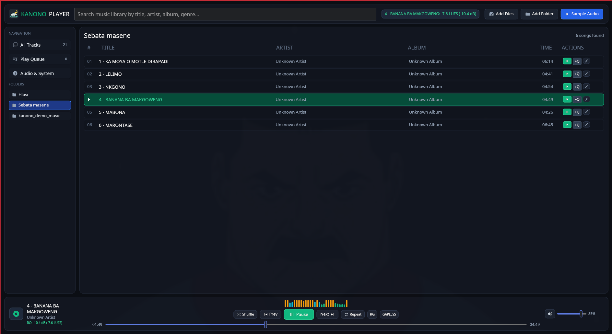
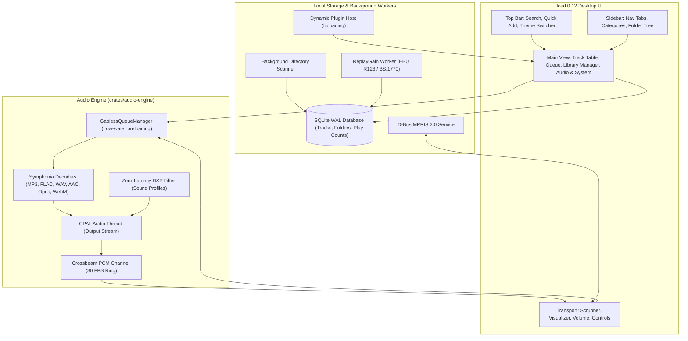

<div align="center">
  
  <h1>Kanono Media Player</h1>
  <p><strong>A fast, modular desktop music player for focused listening and deep library control.</strong></p>
  <p>Built with Rust, Iced, CPAL, and Symphonia. Inspired by the speed and flexibility of Foobar2000.</p>

  [](#license)
  [](https://www.rust-lang.org/)
  [](https://github.com/iced-rs/iced)
  [](https://github.com/pdeljanov/Symphonia)
  [](#installation--getting-started)
</div>

<p align="center">
  <a href="#quick-start">Quick start</a> ·
  <a href="#screenshots">Screenshots</a> ·
  <a href="#features">Features</a> ·
  <a href="#installation--getting-started">Installation</a> ·
  <a href="#plugin-development">Plugins</a>
</p>

<p align="center">
  
</p>

## A Player Built Around Your Library

Kanono is a lightweight, customizable player for audiophiles, power users, and collectors. Browse a large collection quickly, queue music without losing your place, tune the playback chain, and keep the desktop integration you expect.

Audio processing, metadata decoding, library scanning, and GUI rendering run on dedicated asynchronous paths to keep the interface responsive during everyday playback and catalog work.

| Library-first workflow | Playback control | Desktop-ready |
| --- | --- | --- |
| Fast filtering, folder browsing, batch tagging, and SQLite-backed indexing | Gapless queueing, ReplayGain, DSP profiles, and a 28-band visualizer | MPRIS 2.0, media keys, theme cycling, and dynamic components |

## Quick Start

```bash
git clone https://github.com/majortank/kanono-media-player.git
cd kanono-media-player
cargo run -p kanono-player
```

See [Installation](#installation--getting-started) for Linux dependencies, release builds, and PipeWire tuning.

## Screenshots

### Playback and Queue

<p align="center">
  
</p>

The main view keeps search, collection filters, the queue, transport controls, and the live spectrum within reach.

### Library Management

<p align="center">
  
</p>

Register music folders, monitor scans, review catalog statistics, and run maintenance from one workspace.

### Audio and System

<p align="center">
  
</p>

Configure output, latency, loudness, sound profiles, themes, and loaded components without leaving the player.

## Features

### Playback and Sound

- **Format support:** MP3, FLAC, WAV, OGG Vorbis, AAC, M4A, Opus, MP4 audio, and WebM audio through Symphonia.
- **DSP profiles:** Flat, Bass Boost, Warm Vintage, Vocal Clarity, Treble Air, and Club Punch.
- **ReplayGain:** Background EBU R128 / ITU-R BS.1770 analysis with selectable -14, -18, and -23 LUFS targets.
- **Visualizer:** Theme-aware, 28-band RMS spectrum metering driven from output PCM.
- **Output controls:** Inspect the active device and host API, choose adaptive, low-latency, balanced, or safe buffers, and run stereo test tones.

### Library and Queue

- **SQLite-backed catalog:** Track multiple folders with asynchronous indexing, rescans, missing-file cleanup, and catalog reset tools.
- **Flexible discovery:** Filter by artist, album, genre, duration, year, BPM, and folder hierarchy; surface frequently played tracks.
- **Batch work:** Select multiple tracks to play, queue, remove, or update tags together.
- **Responsive queueing:** Gapless queue management with low-water preloading.

### Desktop and Customization

- **Six curated themes:** Emerald Dark, Midnight Cyberpunk, Nordic Frost, Amber Sunset, Dracula, and Solarized Light.
- **MPRIS 2.0:** Desktop widgets and media keys can control playback and receive synchronized metadata.
- **Plugin host:** Load shared-library components from `components/` and manage them from the Audio & System view.

## Architecture Overview



---

## Installation & Getting Started

### Prerequisites

Kanono requires a 64-bit operating system with Rust (1.75+) installed via [rustup](https://rustup.rs/):

```bash
curl --proto '=https' --tlsv1.2 -sSf https://sh.rustup.rs | sh
```

#### Linux System Dependencies

- **Arch Linux / Manjaro:**
  ```bash
  sudo pacman -S alsa-lib dbus libxkbcommon vulkan-icd-loader
  ```
- **Ubuntu / Debian / Linux Mint:**
  ```bash
  sudo apt update && sudo apt install -y \
    build-essential \
    pkg-config \
    libasound2-dev \
    libdbus-1-dev \
    libxkbcommon-dev \
    libxkbcommon-x11-dev
  ```
- **Fedora / RHEL:**
  ```bash
  sudo dnf install \
    alsa-lib-devel \
    dbus-devel \
    libxkbcommon-devel \
    libxkbcommon-x11-devel \
    vulkan-loader-devel
  ```

---

### Building from Source

1. **Clone the repository:**
   ```bash
   git clone https://github.com/majortank/kanono-media-player.git
   cd kanono-media-player
   ```

2. **Run in development mode:**
   ```bash
   cargo run -p kanono-player
   ```

3. **Build optimized release binary:**
   ```bash
   cargo build --release -p kanono-player
   ```
   The executable is produced at `./target/release/kanono-player`.

4. **Install to user binaries (optional):**
   ```bash
   sudo install -Dm755 target/release/kanono-player /usr/local/bin/kanono-player
   ```

5. **Run with low-latency PipeWire (optional):**
   ```bash
   PIPEWIRE_LATENCY=128/48000 ./target/release/kanono-player
   ```

---

## Running Tests

Run the full workspace test suite (including audio resampling, decoding, database indexing, and theme verification):

```bash
cargo test --workspace
```

To run individual crate tests:
```bash
# Audio Engine (decoder, output, ReplayGain, queue management)
cargo test -p kanono-audio-engine

# Main Application & Theme Engine
cargo test -p kanono-player
```

---

## Plugin Development Guide

Kanono includes a dynamic plugin interface in [crates/plugin-api](crates/plugin-api) allowing shared libraries (`.so` / `.dll` / `.dylib`) to extend player features.

### Building the Example Plugin

1. Compile the included example component:
   ```bash
   cargo build -p kanono-example-component --release
   ```
2. Create the components directory and install the component:
   ```bash
   mkdir -p components
   cp target/release/libkanono_example_component.so components/
   ```
3. Start `kanono-player`; the plugin is automatically detected and listed under the **Audio & System** control center.

### Creating a Custom Plugin

Implement the `RegisteredPlugin` trait in your crate (`crate-type = ["cdylib"]`):

```rust
use kanono_plugin_api::{KanonoPlugin, PluginMetadata};

pub struct MyAwesomePlugin;

impl KanonoPlugin for MyAwesomePlugin {
    fn metadata(&self) -> PluginMetadata {
        PluginMetadata {
            name: "My Awesome Plugin".into(),
            version: "1.0.0".into(),
            author: "Your Name".into(),
            description: "Adds custom processing to Kanono".into(),
        }
    }

    fn on_load(&mut self) -> Result<(), String> {
        println!("Plugin loaded!");
        Ok(())
    }

    fn on_unload(&mut self) {
        println!("Plugin unloaded!");
    }
}

// Export the required ABI entry point
kanono_plugin_api::export_plugin!(MyAwesomePlugin);
```

---

## Performance Profiling & Benchmarks

To benchmark audio callback throughput:
```bash
cargo bench -p kanono-audio-engine --bench audio_callback
```
Criterion HTML reports are saved to `target/criterion/` for regression analysis.

To generate a CPU flamegraph during playback:
```bash
cargo install cargo-flamegraph
cargo flamegraph --profile profiling --bin kanono-player
```

---

## Configuration & Environment Variables

| Variable | Description | Default |
| :--- | :--- | :--- |
| `KANONO_COMPONENTS_DIR` | Custom directory path for dynamic plugins | `./components` |
| `PIPEWIRE_LATENCY` | Overrides PipeWire quantum and rate buffer | Managed by PipeWire |
| `RUST_LOG` | Configures logging verbosity (`info`, `debug`, `trace`) | `warn` |

---

## Release Packages

Automated GitHub Actions workflows package the following native binaries on tagged releases:

- **Linux**: `kanono-media-player-linux-x64.tar.gz` (executable, desktop launcher, scalable hicolor icons under `/usr`).
- **Windows**: `kanono-media-player-windows-x64-setup.exe` (Inno Setup installer with Start Menu shortcuts).
- **macOS**: `kanono-media-player-macos-arm64.dmg` (Apple Silicon) and `kanono-media-player-macos-x64.dmg` (Intel).
- **Arch Linux**: `PKGBUILD` included in repository root for AUR packaging.

---

## License

Kanono Media Player is open-source software licensed under either:
- **MIT License** ([LICENSE-MIT](LICENSE-MIT) or [http://opensource.org/licenses/MIT](http://opensource.org/licenses/MIT))
- **Apache License, Version 2.0** ([LICENSE-APACHE](LICENSE-APACHE) or [http://www.apache.org/licenses/LICENSE-2.0](http://www.apache.org/licenses/LICENSE-2.0))

at your option.